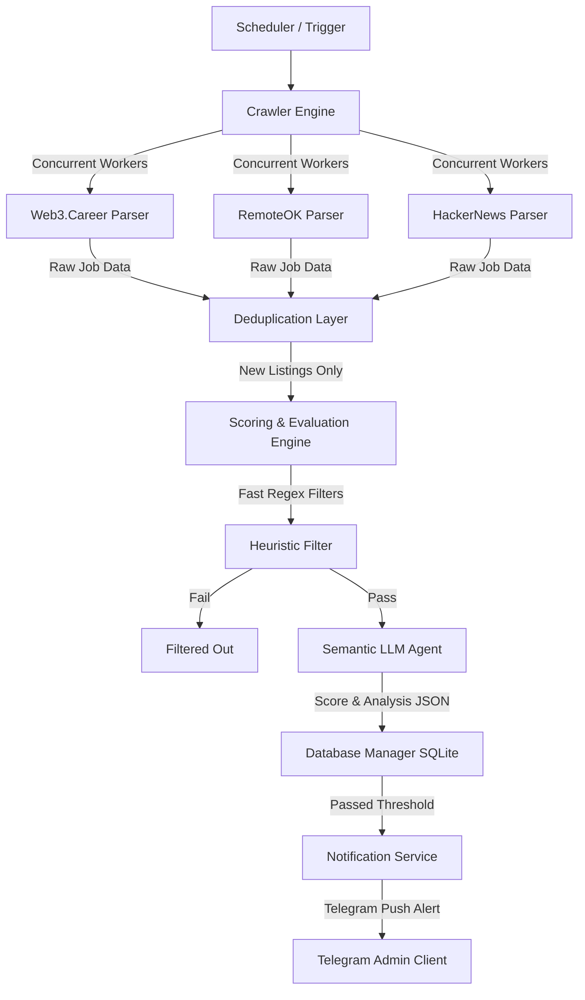

# 🤖 Autonomous AI-Agent Job Search Orchestrator

[](https://www.python.org/downloads/)
[](https://docs.python.org/3/library/asyncio.html)
[](https://docs.aiogram.dev/)
[](https://www.docker.com/)
[](https://opensource.org/licenses/MIT)

An advanced, production-grade asynchronous pipeline designed to crawl job boards, execute concurrent multi-source parsing, evaluate positions using semantic LLM-based analysis, and dispatch notifications to Telegram channels.

This project is a showcase of high-quality **asynchronous Python architecture**, demonstrating clean software engineering, database optimizations, containerized deployment, and integrations with Large Language Models.

---

## 🏗️ Architecture & Pipeline Flow

The orchestrator operates on a modular pipelines model, separating concerns between asynchronous fetching, heuristic filtering, cognitive evaluation, and notification delivery.



---

## ⚡ Core Engineering Highlights

### 1. High-Performance Asynchronous Concurrency
* Utilizes **asyncio** and **httpx** to perform concurrent page scrapes across multiple job boards.
* Employs **semaphores** to enforce strict rate-limiting, preventing IP blacklists.
* Implements **exponential backoff retry policies** to gracefully handle network issues and rate limits.

### 2. Multi-Tier Intelligent Scoring
* **Heuristics Tier:** High-performance pre-compiled regex matching filters out mismatched positions (e.g., senior roles, outdated stack) in milliseconds, saving LLM tokens.
* **Cognitive Semantic Tier:** Jobs that pass heuristics are processed by an LLM-Agent (OpenAI/Fireworks APIs) using custom prompt templates to score alignment and compile analytical feedback.

### 3. Database Layer Optimizations
* Implements an asynchronous wrapper around SQLite via **aiosqlite**, featuring parameterized queries to prevent SQL injections.
* Custom database indices (`idx_jobs_score`, `idx_jobs_source_ext`) ensure high-speed querying of top-scoring leads even as the database scales.

### 4. Advanced Telegram MVC Controls
* Developed using **aiogram v3** (Model-View-Controller framework).
* Integrates custom commands `/run` (force scraping cycles), `/top` (list recommendations), `/stats` (analytics), and `/cover` (auto-generate cover letters customized to specific job descriptions).

---

## 📂 Codebase Overview

```
job-hunter-bot-showcase/
├── main.py              # Orchestration entry point and APScheduler
├── config.py            # Strong-typed settings schema (dataclasses + python-dotenv)
├── database.py          # Asynchronous parameterized database wrapper (aiosqlite)
├── scorer.py            # Keyword heuristic and LLM semantic match scoring engines
├── bot.py               # MVC architecture Telegram Bot command handlers (aiogram v3)
├── Dockerfile           # Multi-stage production Docker container definition
├── docker-compose.yml   # One-click Docker Compose deployment specification
├── .env.example         # Environment configuration template
├── requirements.txt     # Dependency locklist
└── parsers/             # Concurrent scraping microservices
    ├── base.py          # Abstract scraper class with retry logic & request sessions
    └── example_parser.py# Extensible BeautifulSoup HTML scraping subclass
```

---

## 🚀 Quick Start (Docker Containerized)

The easiest way to run the orchestrator in production or locally is via **Docker Compose**:

```bash
# 1. Clone the repository
git clone https://github.com/klmtzz/job-hunter-bot-showcase.git
cd job-hunter-bot-showcase

# 2. Configure environment variables
cp .env.example .env
# Edit .env with your BOT_TOKEN and TELEGRAM_CHAT_ID

# 3. Launch via Docker Compose
docker-compose up -d --build
```

### 🛠️ Local Python Setup (Without Docker)

```bash
# 1. Create and activate a virtual environment
python3 -m venv .venv
source .venv/bin/activate

# 2. Install dependencies
pip install -r requirements.txt

# 3. Copy environment configuration
cp .env.example .env

# 4. Run the orchestrator
python main.py
```

---

## 📝 Design Patterns Demonstrated
* **Abstract Factory / Base Template:** Used in `BaseParser` to enforce schema constraints on scraper subclasses.
* **Singleton / Global Config:** Configurations are initialized once in `config.py` and exported cleanly.
* **Separation of Concerns (SoC):** Database manipulation, scoring algorithms, and messaging protocols are decoupled and isolated.

---

## 📜 License
Distributed under the MIT License. See `LICENSE` for more information.
